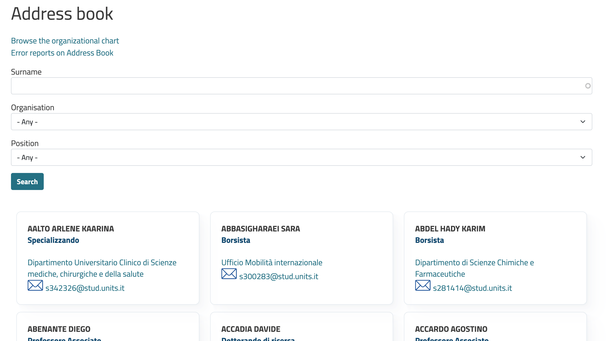
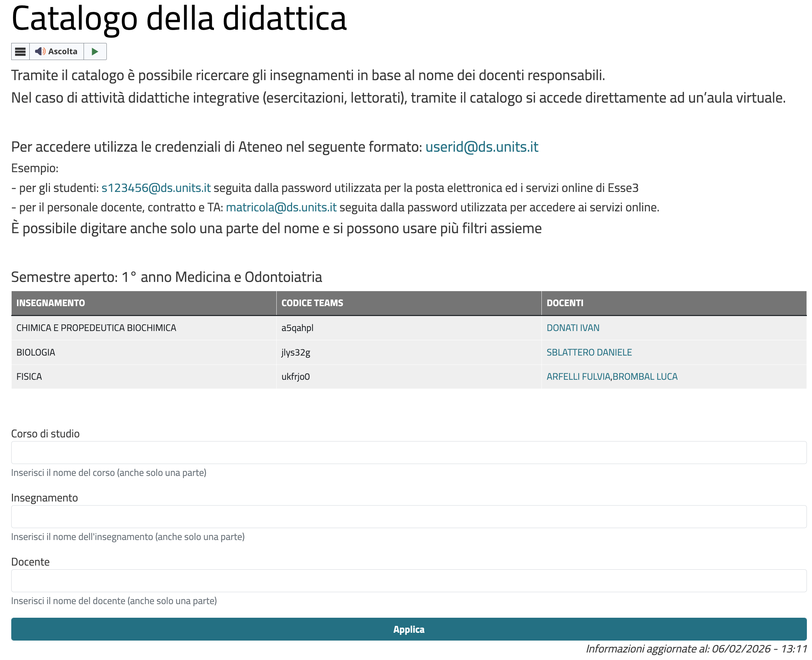
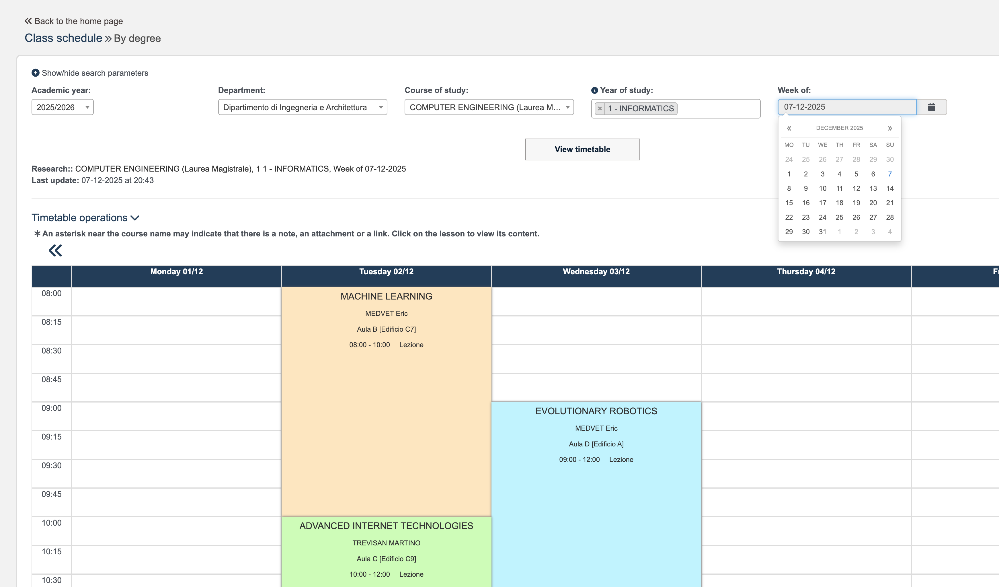
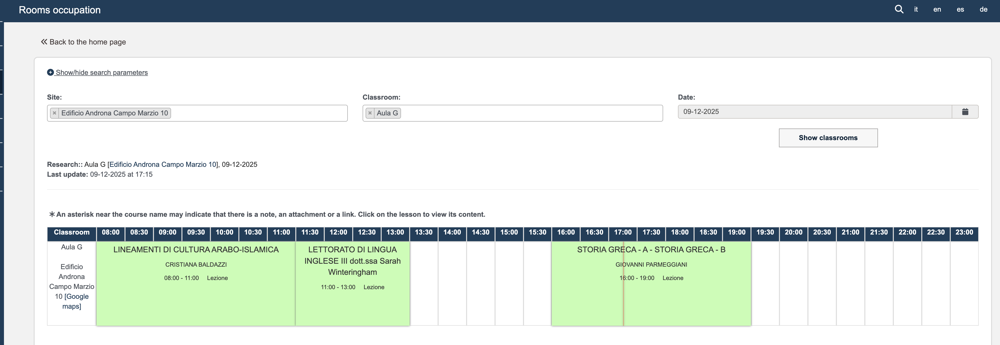

# Custom Scraper for UniTS Data

This is a custom web scraper designed to extract various data from the University of Trieste (UniTS) portal. It downloads information including the address book (professors, staff, etc.), course lists, room information, lesson schedules, and room calendars (including events beyond just lessons).

## Features

- **Address Book**: Extracts contact information for professors and university staff.
- **Courses List**: Retrieves course details including Teams codes for online courses.
- **Room Information**: Gathers details about university rooms, including location, capacity, and equipment.
- **Lesson Calendar**: Scrapes academic schedules and lesson timetables.
- **Room Calendar**: Collects room occupancy and event schedules.

## Installation

1. Ensure you have Python 3.8 or higher installed on your system.
2. Clone or download this repository.
3. Install the required dependencies:
   ```bash
   pip install -r requirements.txt
   ```

The project uses libraries such as BeautifulSoup4 for HTML parsing, requests for HTTP requests, joblib for parallel processing, and Selenium for browser automation to handle dynamic web content.

## Usage

The project consists of multiple Python scripts, each handling the scraping of one specific data type. It is recommended to run the provided shell script for a full pipeline execution:

```bash
./pipeline_full_scraping.sh
```

Before running, modify the following parameters in the script:
```bash
START_DATE="2026-03-01"
END_DATE="2026-03-08"
OUTPUT_DIR="scraper_results_schedules_book_rooms_cources"
```

The script will:
- Create a virtual environment if not present.
- Install the required dependencies.
- Perform scraping of all data, considering the start and end dates (applicable to date-dependent scrapers like lesson calendars).

Alternatively, you can run individual scripts:
- `fetch_address_book.py` for address book data.
- `fetch_courses_with_teams_code.py` for courses list.
- `fetch_info_rooms.py` for room information.
- `fetch_lessons_calendar.py` for lesson schedules.
- `fetch_rooms_calendar.py` for room calendars.

Results are saved as JSON files in the specified output directory.

## Data Sources and Examples

### Address Book
Source: [UniTS Address Book](https://portale.units.it/en/rubrica)



Example of a single entry:
```json
{
    "nome": "Adamo Sergia",
    "role": "Professore Ordinario",
    "department": "Dipartimento di Studi Umanistici",
    "department_staff_url": "https://portale.units.it/it/ugov/organizationunit/27686",
    "phone": "0405584368",
    "email": "adamo@units.it",
    "last_updated": "14/03/2026",
    "doc_type": "rubrica personale/professori/staff dell'università"
}
```

### Courses List
Source: [UniTS Course Catalog](https://www.units.it/catalogo-della-didattica-a-distanza)



Example of a single entry:
```json
{
    "course_code": "041AR",
    "teams_code": "slw8irt",
    "degree_program_code": "AR03",
    "academic_year": "2025/2026",
    "teacher_name": "BEDON CHIARA",
    "teacher_id": "014686",
    "period": "S1",
    "course_name": "ANALISI DELLE STRUTTURE",
    "degree_program": "ARCHITETTURA",
    "degree_program_eng": "ARCHITECTURE",
    "last_update": "14/03/2026"
}
```

### Room Information


Example of a single entry:
```json
{
  "room_name": "Aula 2.5 Microscopia",
  "room_code": "017_02",
  "site_name": "Palazzina T",
  "site_code": "BT01",
  "address": "Via Edoardo Weiss, 15",
  "floor": "PianoT",
  "room_type": "non definito",
  "capacity": 38,
  "accessible": false,
  "maps_url": "https://www.google.com/maps?q=45.660185354429466,13.80443422072853",
  "maps_embed_url": "https://www.google.com/maps/embed?pb=!1m18!1m12!1m3!1d815.80288698819!2d13.80443422072853!3d45.660185354429466!2m3!1f0!2f0!3f0!3m2!1i1024!2i768!4f13.1!3m3!1m2!1s0x477b6b480db6f519%3A0x8d54533258604fb0!2sUniversit%C3%A0%20degli%20Studi%20di%20Trieste%20-%20Dipartimento%20di%20Scienze%20Mediche%20-%20Palazzina%20T!5e1!3m2!1sit!2sit!4v1743428037044!5m2!1sit!2sit",
  "occupancy_building_url": "https://orari.units.it/agendaweb/index.php?view=rooms&include=rooms&_lang=it&sede=BT01",
  "occupancy_room_url": "https://orari.units.it/agendaweb/index.php?view=rooms&include=rooms&_lang=it&sede=BT01&aula=017_02",
  "equipment": [
    {
      "name": "Rete wifi eduroam",
      "status": "DISPONIBILE"
    },
    {
      "name": "Rete cablata eduroam",
      "status": "DISPONIBILE"
    },
    {
      "name": "Proiettore",
      "status": "DISPONIBILE"
    }
  ],
  "scrape_ok": true,
  "room_url": "",
  "url": "https://orari.units.it/agendaweb/index.php?form-type=vetrina_aule&view=vetrina_aule&include=vetrina_aule&_lang=it&list=&week_grid_type=-1&ar_codes_=&ar_select_=&col_cells=0&empty_box=0&only_grid=0&highlighted_date=0&all_events=0&sede%5B%5D=BT01&aula%5B%5D=017_02"
}
```

### Lesson Calendar


Example of a single entry:
```json
{
    "department": "DipartimentodiFisica",
    "degree_program_code": "SM20",
    "degree_program_name": "FISICA (Bachelor Degree)",
    "subject_code": "EC462850",
    "subject_name": "ELETTRODINAMICA E RELATIVITA' SPECIALE",
    "study_year_code": "PDS0-2024|2",
    "curriculum": "2 - Comune with all other curricula of that course",
    "date": "2026-02-23",
    "start_time": "09:00",
    "end_time": "11:00",
    "room_code": "024_5",
    "room_name": "Aula A",
    "site_name": "Edificio F",
    "site_code": "AF01",
    "address": "Via Alfonso Valerio, 2",
    "professors": "CANTATORE GIOVANNI",
    "lesson_type": "N/A",
    "cancelled": "no",
    "url": "https://orari.units.it/agendaweb/index.php?view=easycourse&form-type=corso&include=corso&txtcurr=&anno=2025&scuola=DipartimentodiFisica&corso=SM20&anno2%5B%5D=PDS0-2024%7C2&visualizzazione_orario=cal&date=2026-03-01&periodo_didattico=&_lang=it&list=&week_grid_type=-1&ar_codes_=&ar_select_=&col_cells=0&empty_box=0&only_grid=0&highlighted_date=0&all_events=0&faculty_group=0"
}
```

### Room Calendar


Example of a single entry:
```json
{
    "site_code": "CEN_IDRO",
    "room_code": "14304_001",
    "date": "2026-03-02",
    "last_update": "02-03-2026",
    "site_name": "Centrale Idrodinamica",
    "room_name": "Sala Plenaria",
    "start_time": "11:00",
    "end_time": "13:00",
    "name_event": "INFERMIERISTICA CLINICA NELLE MALATTIE CRONICO-DEGENERATIVE",
    "professors": "CLAUDIA FANTUZZI"
}
```

## Notes

- This scraper is specifically designed for the University of Trieste's systems and does not work with other institutions.
- Data extraction depends on the structure of the university's web pages, which may change over time.
- Respect the terms of service of the UniTS portal and avoid overloading their servers.
- The current date in the examples reflects the scraping date (March 14, 2026).

## Technologies Used

- **Python**: The primary programming language used for all scripts.
- **Selenium**: Used for browser automation to scrape dynamic web content that requires JavaScript rendering.
- **BeautifulSoup4**: Employed for parsing and navigating HTML documents.
- **Requests**: Utilized for making HTTP requests to fetch web pages.
- **Joblib**: Applied for parallel processing to speed up data extraction tasks.